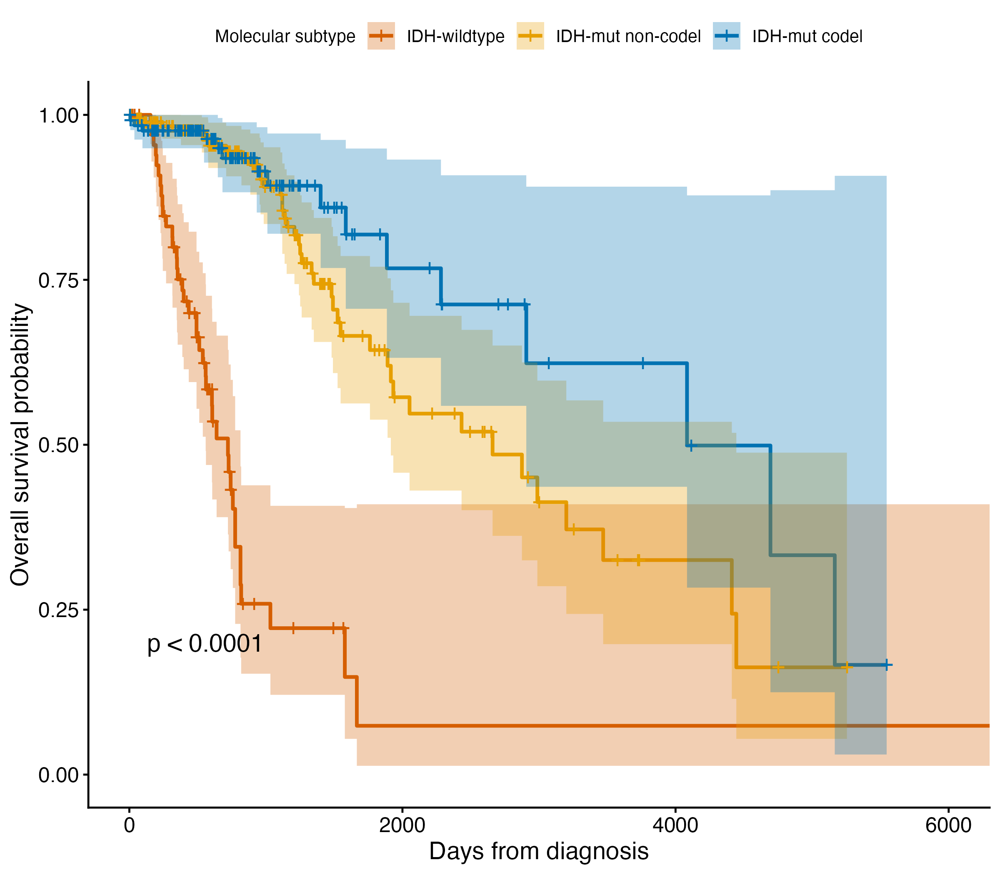

# Molecular vs. histologic risk stratification in low-grade glioma

## Motivation

Low-grade glioma (LGG) was historically graded by histology alone. Ceccarelli
et al. (2016) showed that molecular features *IDH1/IDH2* mutation status and
1p/19q codeletion stratify survival better than histologic grade, a
finding substantial enough that the WHO revised its official classification
of glioma in 2016 to require molecular testing alongside histology.

This project asks three nested questions:

1. Do IDH status and 1p/19q codeletion stratify overall survival better than
   histologic grade alone, in this cohort? *(Reproduces the known finding —
   the sanity check that the data pipeline is correct.)*
2. Does a Cox model built on RNA-seq expression features add prognostic value
   on top of IDH/1p19q status?
3. Does that combined model hold up under nested cross-validation and,
   ideally, external validation?

## Data

TCGA-LGG, pulled via `TCGAbiolinks` from GDC: clinical/survival data, curated
molecular subtype calls (IDH, 1p/19q), and RNA-seq expression
(STAR-Counts, harmonized GDC pipeline).

## Methods

**Cohort.** Primary tumor samples only (n=516). Patients were excluded for:
missing IDH/1p19q molecular subtype call (n=3), unknown vital status (n=1),
missing death date among deceased patients (n=1), and invalid follow-up time
(n=1 negative value), yielding a final analysis cohort of **508 patients,
123 deaths (24% event rate)**.

Grade and survival fields were taken from GDC's harmonized clinical table;
molecular subtype calls (IDH status, 1p/19q codeletion) were taken from the
curated PanCancer Atlas publication fields, to match the original
classification literature. Grade concordance between the two sources was
verified at 100% (456/456 patients with grade in both).

**Split.** Patients were split 80/20 into train/test, stratified jointly on
IDH/codel subtype and event status (seed = 42). Train: n=404, 97 events.
Test: n=104, 26 events. The test set was not examined prior to or during
model development.

**Survival analysis.** Kaplan-Meier curves and log-rank tests compared
overall survival across histologic grade (G2/G3) and molecular subtype.
Cox proportional hazards models quantified effect sizes as hazard ratios
with 95% CIs; discrimination was assessed via Harrell's concordance index.
The proportional hazards assumption was tested via Schoenfeld residuals
(`cox.zph`). All modeling in this section was performed on the training
set only.

## Results — Hypothesis 1: Molecular subtype vs. histologic grade

Consistent with Ceccarelli et al. (2016), molecular subtype stratified
overall survival far more sharply than histologic grade.

| Model | C-index | SE |
|---|---|---|
| Histologic grade (G2/G3) | 0.653 | 0.025 |
| Molecular subtype (IDH/codel) | 0.741 | 0.032 |
| Subtype + grade + age | 0.817 | 0.023 |

Log-rank test for molecular subtype: χ² = 106, df = 2, p < 2×10⁻¹⁶.
Log-rank test for grade: χ² = 27.9, df = 1, p = 1×10⁻⁷.

Relative to IDH-wildtype (reference), hazard ratios from the subtype-only
Cox model:

| Subtype | HR | 95% CI | Events / N |
|---|---|---|---|
| IDH-mutant, non-codeleted | 0.168 | (0.106, 0.265) | 41 / 197 |
| IDH-mutant, codeleted | 0.107 | (0.059, 0.193) | 16 / 132 |
| IDH-wildtype (reference) | 1.00 | — | 40 / 75 |

IDH-wildtype tumors — despite being histologically graded as low-grade
(WHO grade II/III) — showed survival behavior consistent with glioblastoma:
53% mortality in this cohort vs. 21% (non-codel) and 13% (codel) in the
IDH-mutant groups.



**Molecular subtype and histologic grade are complementary, not redundant.**
The jump from subtype alone (0.741) to the combined model (0.817) is nearly
as large as the jump from grade alone to subtype alone, indicating grade
retains independent prognostic value even after accounting for molecular
status — mirroring current WHO practice of integrated diagnosis.

**Proportional hazards.** The PH assumption was violated for IDH/codel
status (χ² = 14.9, df = 2, p = 6×10⁻⁴), and for all covariates in the
combined model (global p = 0.002). Schoenfeld residuals show the survival
difference between IDH-wildtype and IDH-mutant groups is most pronounced in
the first ~2 years and attenuates thereafter — consistent with
IDH-wildtype's rapid early mortality: by day 2000, only 1 of 75
IDH-wildtype patients remained under observation. Reported hazard ratios
should be read as an average effect over follow-up rather than a constant
instantaneous risk; the qualitative conclusion is well-supported regardless.

## Limitations

Median follow-up in this cohort is under 2 years, despite a small number of
patients followed beyond 15 years. Risk tables accompanying all KM plots
should be consulted before interpreting survival estimates beyond ~3 years,
where patient counts in some subgroups drop into single digits.

## Results — Hypothesis 2: Does expression add value beyond molecular subtype?

An elastic-net Cox model was fit on 5,000 variance-filtered genes (selected
using training data only; see Methods) via nested cross-validation: an outer
loop (5 folds, stratified on event status) provided an out-of-sample
performance estimate, while an inner loop (5-fold, via `cv.glmnet`) selected
the regularization penalty (λ) independently within each outer fold. Both a
baseline model (IDH/codel subtype + grade + age) and an extended model
(baseline + an expression-derived risk score) were fit identically within
each outer fold and evaluated on the same held-out patients, allowing a
direct, paired comparison.

| Fold | n (test) | Events | λ | Genes selected | C-index (baseline) | C-index (extended) |
|---|---|---|---|---|---|---|
| 1 | 82 | 20 | 0.079 | 68  | 0.751 | 0.808 |
| 2 | 82 | 20 | 0.061 | 103 | 0.847 | 0.855 |
| 3 | 80 | 19 | 0.005 | 458 | 0.756 | 0.690 |
| 4 | 80 | 19 | 0.088 | 58  | 0.826 | 0.846 |
| 5 | 80 | 19 | 0.005 | 482 | 0.826 | 0.820 |
| **Mean** | | | | | **0.801** | **0.804** |

**Expression does NOT improve prediction beyond molecular
subtype, grade, and age.** The mean improvement across folds (+0.003) is
well within the range expected from fold-to-fold sampling noise on outer-test
sets of ~80 patients, and the direction is inconsistent — three folds show a
small gain, two show a loss, including one fold (fold 3) where the
extended model underperformed baseline by 0.066 despite retaining the most
genes (458) of any fold. Retaining more genes did not translate into better
discrimination, which argues against "insufficient gene selection" as an
explanation for the null result.

This is consistent with the underlying biology rather than a failure of the
modeling approach: IDH mutation status is a genome-wide driver of tumor
biology, and much of the prognostic signal in bulk gene expression is
plausibly downstream of, and therefore redundant with, the molecular subtype
already captured directly by IDH/1p19q status. A well-powered baseline model
built on established molecular and clinical variables leaves comparatively
little independent signal for a bulk expression signature to add — a finding
consistent with, though not identical to, why single-cell and pathway-level
approaches are often needed to extract prognostic signal beyond what driver
mutations already explain.

This null result is treated as a genuine finding rather than a modeling
shortfall. It was reached only after correcting the modeling pipeline
against a real bug: an initial run of this analysis produced C-index values
below 0.5 across all folds, traced to a sign convention mismatch in how
`survival::concordance()` interprets a Cox linear predictor when called via
its formula interface. Once corrected (risk scores negated to match
`coxph`'s higher-linear-predictor-equals-higher-risk convention, verified
against `summary(coxph_fit)$concordance` on the same data), baseline
concordance values recovered to the 0.75–0.85 range consistent with
Hypothesis 1's full-training-set estimate, and the null result reported
above held.

### final_evaluation.R
The final model — Cox proportional hazards on IDH/codel subtype, histologic
grade, and age, fit on the full training set (n=404) — achieved a
concordance of 0.902 (SE 0.023, 95% CI 0.857–0.947) on the held-out test set
(n=104, 26 events), compared to 0.817 (SE 0.023, 95% CI 0.773–0.861) on the
training set itself.

The two estimates are close, with confidence intervals that only narrowly
overlap. Subtype-by-event composition was confirmed nearly identical between
train and test (verifying the stratified split performed as intended), so
the higher test-set point estimate is not attributable to an easier or more
skewed test population. Given the modest size of the test set (26 events),
some of **this difference is plausibly attributable to sampling variability in
the test-set estimate rather than genuinely superior generalization**; a
larger or external test set would be needed to resolve this with more
precision. Taken together, both estimates support a robust model with
concordance in the 0.80–0.90 range — well above histologic grade alone
(0.653) and consistent with the model's performance during cross-validated
development.

## App

## App

An interactive Shiny app lets a user enter a hypothetical patient's
molecular subtype, histologic grade, and age, and view a model-predicted
survival curve for that profile — the same three-variable Cox model
(`final_fit`) evaluated in the final test-set analysis above.

**What it shows.** Two curves are plotted together:

- **Predicted (red)** — the Cox model's survival estimate for the entered
  patient profile, computed via `survfit(final_fit, newdata = patient)`.
- **Training cohort reference (grey)** — an empirical Kaplan-Meier curve
  built from real training patients matching the entered subtype *and*
  grade, labeled with its actual sample size and event count (e.g.,
  "n=42, 8 events"). A warning is shown when this reference group is small
  (n < 20), since a thin reference group means the prediction sits in a
  region with limited real-world support.

**How the predicted curve is generated, and why the reference count
matters.** The predicted (red) curve is a parametric prediction, not an
empirical one — it has no sample size of its own. Its timepoints are fixed
by the training set's ~97 unique event days regardless of the patient
profile entered; what varies between different inputs is only the curve's
height at each of those fixed points, driven by that profile's hazard
ratios. Critically, **the model will produce a fully-formed, confident-
looking curve for any input, including subtype/grade/age combinations that
are rare or entirely absent from the training data** — nothing about the
predicted curve's appearance distinguishes interpolation (a well-supported
prediction) from extrapolation (a prediction with little or no real
evidence behind it). The grey reference curve's sample size is the only
signal in the app that speaks to this, which is why it's shown explicitly
rather than only as a background KM line, and why predictions should always
be read alongside it rather than in isolation.

**Validation context.** The app permanently displays the model's training
(0.817) and test-set (0.902) concordance, so this context is visible every
time the tool is used, not only to someone who separately reads this
README.

**This is a research demonstration, not a validated clinical tool.** It has
not undergone the analytical or clinical validation (see earlier discussion
of CLSI/FDA validation frameworks) that would be required before informing
any real clinical decision, and predictions for rare covariate
combinations should be treated with particular skepticism given the
extrapolation issue described above.

*Live app: [https://alex-hannah.shinyapps.io/lgg-survival-risk/](https://alex-hannah.shinyapps.io/lgg-survival-risk/)*

**Running locally:**
```r
shiny::runApp("app")
```

## Reproducing this

See [SETUP.md](SETUP.md) for environment setup (`renv` + Bioconductor).